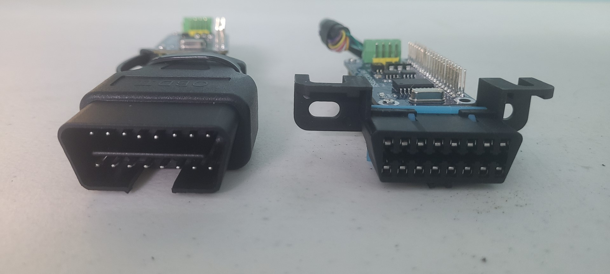
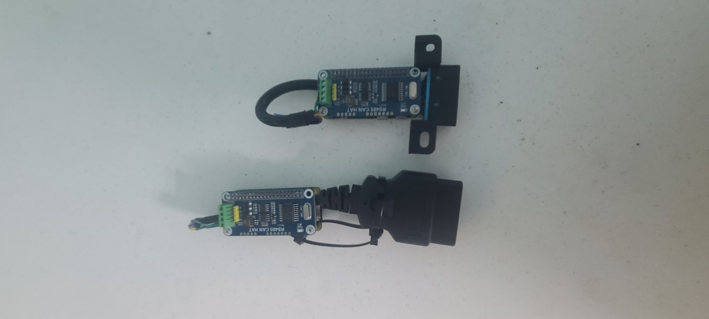
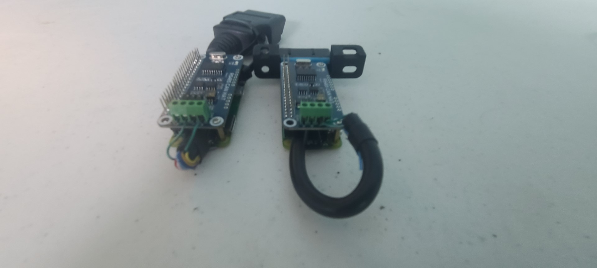
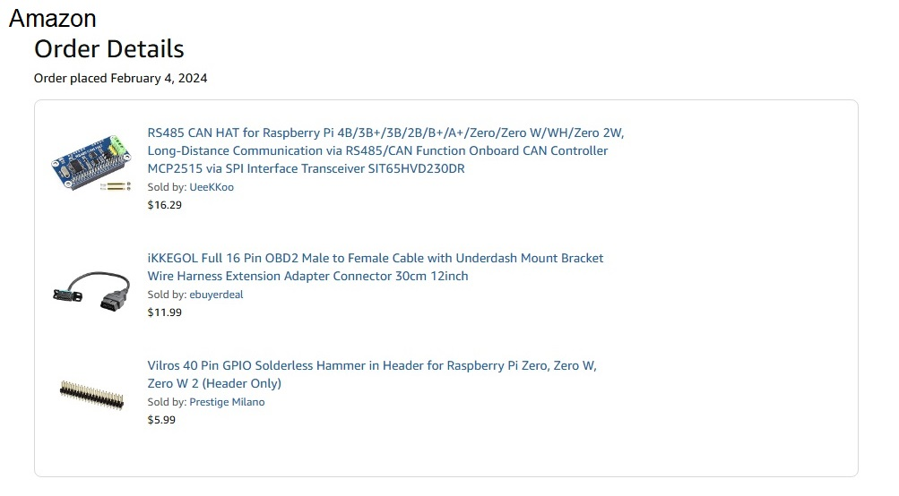

# OBD2-CANbus-Diagnostic-Adapter-for-Raspberry-Pi
Python-based OBD2 CANbus adapter for Raspberry Pi Zero W enabling real-time vehicle diagnostics and data logging. Ideal for automotive developers and DIY enthusiasts, it accurately reads and decodes OBD-II data over CAN bus, supporting advanced car diagnostics, telemetry, and performance monitoring.

## Features

- Connects Pi Zero W to vehicle OBD2 port using standard CAN bus interface  
- Reads and decodes CAN messages using Python  
- Lightweight, designed for low-power headless setups (like Pi Zero W)  
- Extensible for custom PID decoding and live data logging  

## Requirements

- Raspberry Pi Zero W  
- Waveshare CAN hat 
- OBD2 cable  
- Python 3

**Python Libraries**:

- `python-can`   
- `can-utils` (for Linux setup/testing)  

## Installation

Install dependencies:

```bash
pip install python-can
```

Enable SPI on the Pi and configure `can0` interface (edit `/boot/config.txt`):


Edit the config file
sudo nano /boot/config.txt

#Add this to the file (Verify the oscillator speed of 12 on the board):

#Enable CAN communication
dtoverlay=mcp2515-can0,oscillator=12000000,interrupt=25,spimaxfrequency=2000000

#Reboot
sudo reboot


## File Structure

```
canbus-obd2/
+-- README.md               ? This file
+-- LICENSE                 ? MIT license (modifiable)
+-- scripts/
+-- notes/
```

## Usage

To read raw CAN data from the vehicle

## Project Images






## License

MIT © [Your Name or GitHub Handle]  
Feel free to modify and use under the terms of the MIT license.
